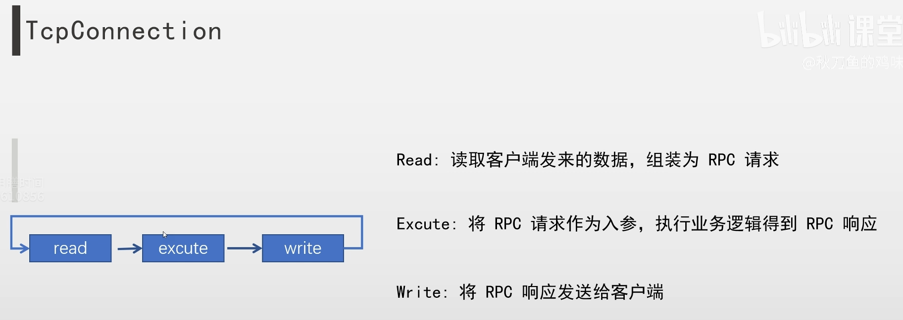

学习用个人rpc框架实现

- [前置知识](#前置知识)
- [环境](#环境)
- [Config](#config)
  - [config.h](#configh)
  - [xml读取宏](#xml读取宏)
  - [config.cc](#configcc)
- [Mutex](#mutex)
  - [mutex.h](#mutexh)
  - [参考](#参考)
- [Logger](#logger)
  - [log.cc](#logcc)
  - [formatString](#formatstring)
  - [日志宏](#日志宏)
  - [log.cc](#logcc-1)
- [Reactor(EventLoop)](#reactoreventloop)
  - [Reactor 模型概念](#reactor-模型概念)
  - [FdEvent](#fdevent)
    - [fd\_event.h](#fd_eventh)
    - [fd\_event.cc](#fd_eventcc)
  - [WakeUpFdEvent](#wakeupfdevent)
  - [EventLoop](#eventloop)
    - [eventloop.h](#eventlooph)
    - [添加EPOLL事件宏](#添加epoll事件宏)
    - [删除EPOLL事件宏](#删除epoll事件宏)
    - [eventloop.cc](#eventloopcc)
      - [初始化与析构](#初始化与析构)
      - [主循环](#主循环)
      - [辅助函数](#辅助函数)
      - [添加/删除EPOLL操作](#添加删除epoll操作)
  - [TimerEvent](#timerevent)
    - [timer\_event.h](#timer_eventh)
    - [timer\_event.cc](#timer_eventcc)
  - [Timer](#timer)
    - [timer.h](#timerh)
    - [timer.cc](#timercc)
      - [addTimerEvent/deleteTimerEvent](#addtimereventdeletetimerevent)
      - [onTimer](#ontimer)
      - [resetArriveTime](#resetarrivetime)
  - [IO 线程](#io-线程)
    - [io\_thread.h](#io_threadh)
    - [io\_thread.cpp](#io_threadcpp)
    - [io\_thread\_group.h](#io_thread_grouph)
    - [io\_thread\_group.cc](#io_thread_groupcc)
- [TCP](#tcp)
  - [TcpBuffer](#tcpbuffer)
    - [tcp\_buffer.h](#tcp_bufferh)
    - [tcp\_buffer.cc](#tcp_buffercc)
  - [TcpAcceptor](#tcpacceptor)
    - [net\_addr.h](#net_addrh)
    - [net\_addr.cc](#net_addrcc)
    - [tcp\_acceptor.h](#tcp_acceptorh)
    - [tcp\_acceptor.cc](#tcp_acceptorcc)
  - [TcpServer](#tcpserver)
    - [tcp\_server.h](#tcp_serverh)
    - [tcp\_server.cc](#tcp_servercc)
  - [TcpConnection](#tcpconnection)
    - [tcp\_connection.h](#tcp_connectionh)
    - [tcp\_connection.cc](#tcp_connectioncc)
  - [TcpClient](#tcpclient)
- [RPC](#rpc)
  - [协议封装](#协议封装)
  - [模块封装](#模块封装)
- [项目完善](#项目完善)
- [测试](#测试)
  - [log](#log)
  - [eventloop](#eventloop-1)
- [结语](#结语)


# 前置知识
1. C++ 基础语法
2. Linux 环境，Linux 网络编程、Socket 编程
3. Reactor 架构
4. Git
5. 计算机网络知识 
6. ProtoBuf
# 环境
```
protobuf-cpp 
tinyxml 2.6.2
```

# Config
用tinyxml读取配置文件。  

## xml读取宏
##代表拼接成一个的变量声明  
#代表转字符串

```c++
#define READ_XML_NODE(name, parent)                                             \
    TiXmlElement* name##_node = parent->FirstChildElement(#name);               \
    if(!name##_node){                                                           \
        printf("Start lrpc server error, failed to read node [%s]\n", #name);   \
        exit(0);                                                                \
    }                                                                           \

#define READ_STR_FROM_XML_NODE(name, parent)                                    \
    TiXmlElement* name##_node = parent->FirstChildElement(#name);               \
    if(!name##_node || !name##_node->GetText()) {                               \
        printf("Start lrpc server error, failed to read node [%s]\n", #name);   \
    }                                                                           \
    std::string name = std::string(name##_node->GetText());                     \
```
## config.cc
声明一个全局变量用来在初始化时读取配置文件。
```c++
static Config* g_config = NULL;
void Config::SetGlobalConfig(const char* xmlfile){
    if(g_config == NULL){
        g_config = new Config(xmlfile);
    }
}

Config* Config::GetGlobalConfig(){
    return g_config;
}

Config::Config(const char* xmlfile){
    TiXmlDocument* xml_document = new TiXmlDocument();
    bool rt = xml_document->LoadFile(xmlfile);

    if(!rt){
        printf("Start lrpc server error, failed to read config file %s, error info [%s]\n", xmlfile, xml_document->ErrorDesc());
        exit(0);
    }

    READ_XML_NODE(root, xml_document);
    READ_XML_NODE(log, root_node);

    READ_STR_FROM_XML_NODE(log_level, log_node);

    this->log_level_ = log_level;
    
    printf("Config: \n");
    printf("\tlog_level:\t[%s]\n", log_level_.c_str());
}
```

# Mutex
对 POSIX  API 做一下封装  
这里直接用C++ mutex 也可以，内部实现是差不多的  
## Mutex
对pthread_mutex的封装
```c++
class Mutex{
public: 
    Mutex() {
        pthread_mutex_init(&mutex_, NULL);
    }

    ~Mutex(){
        pthread_mutex_destroy(&mutex_);
    }

    void lock(){
        pthread_mutex_lock(&mutex_);
    }

    void unlock(){
        pthread_mutex_unlock(&mutex_);
    }

private:
    pthread_mutex_t mutex_;
};
```

## ScopeMutex
RAII锁
```c++
template<class T>
class ScopeMutex{
public:
    ScopeMutex(T& mutex): mutex_(mutex){
        mutex_.lock();
        is_lock_ = true;
    }
    ~ScopeMutex(){
        mutex_.unlock();
        is_lock_ = false;
    }

    void lock() {
        if(!is_lock_){
            mutex_.lock();
        }
    }

    void unlock(){
        if(is_lock_){
            mutex_.unlock();
        }
    }

private:
    T& mutex_;
    bool is_lock_ {false};
};
```

# Logger

日志模块：
1. 日志级别
2. 打印到文件，支持日期命名，日志滚动。
3. c 格式化风控
4. 线程安全  

日志格式
`[Level][%y-%m-%d %H:%M:%s.%ms]\t[pid:thread_id]\t[file_name:line][%msg]`   

## formatString
实现 `“printf 风格字符串拼接到 std::string”` 的功能，如 `printf("%s, %d", "str", 11);` 等。
 
```c++
template<typename... Args>
std::string formatString(const char* str, Args&& ...args){
    int size = snprintf(nullptr, 0, str, args...); // 获取格式化长度
    std::string result;
    if(size > 0){
        result.resize(size);
        snprintf(&result[0], size + 1, str, args...);
    }
    return result;
}
```
## 日志宏
解释：
如全局日志等级为 INFO, 那么打印 INFO, ERROR, 忽略 INFO > DEBUG  

msg = LogEvent([level][time][pid:tid]) + [文件名:行号] + formatString(msg);  

最后push到全局的logger的队列中  

- __FILE__const char *   文件名
- __LINE__int            行号
- `set(CMAKE_CXX_FLAGS "${CMAKE_CXX_FLAGS} -fmacro-prefix-map=${CMAKE_SOURCE_DIR}=.")` 设置文件路径
- ... 是宏参数占位符    
- __VA_ARGS__是预定义宏名，用于展开所有传入的可变参数    
- 当宏参数为空时，##__VA_ARGS__会自动去掉前一个逗号  

必须在宏定义中写__FILE__和__LINE__因为写在函数中的这两个参数会固定是函数的位置，宏定义展开会在调用的位置。
```c++
// 如全局日志等级为 INFO, 那么打印 INFO, ERROR, 忽略 INFO > DEBUG
#define DEBUGLOG(str, ...)\
    if(lrpc::Logger::GetGlobalLogger()->getLogLevel() <= lrpc::LogLevel::Debug) {\
        char _locBuf[64]; snprintf(_locBuf, sizeof(_locBuf), "%-40s", ("[" + std::string(__FILE__) + ":" + std::to_string(__LINE__) + "]").c_str()); \
        std::string msg = (new lrpc::LogEvent(lrpc::LogLevel::Debug))->toString() + _locBuf \
        + lrpc::formatString(str, ##__VA_ARGS__) + "\n"; \
        lrpc::Logger::GetGlobalLogger()->pushLog(msg);\
        lrpc::Logger::  GetGlobalLogger()->log();\
    }\
```

## log.cc
时间库的用法
- gettimeofday  获取当前时间戳(秒+微秒)
- localtime_r   将时间戳(秒)转换为本地时间的timestamp
- strftime      将timestamp结构转换为格式化字符串"y-m-d  H:M:S"

注意操作队列的时候加锁
```c++
std::string LogEvent::toString(){
    struct timeval now_time;
    gettimeofday(&now_time, nullptr);
    
    struct tm now_time_t;
    localtime_r(&(now_time.tv_sec), &now_time_t);

    char buf[128];
    strftime(&buf[0], 128, "%y-%m-%d %H:%M:%S", &now_time_t);
    
    ctime_ = buf;
    int ms = now_time.tv_usec / 1000;
    ctime_ = ctime_ + "." + std::to_string(ms);

    pid_ = get_process_id();
    tid_ = get_thread_id();

    std::stringstream ss;
    ss  << "["  << LogLevelToString(log_level_) << "]\t"
        << "["  << ctime_ <<"]\t"   
        << "["  << pid_ << ":" << tid_ << "]\t";

    return ss.str();
}
```

# Reactor(EventLoop)
## Reactor 模型概念
Reactor 模式是一种事件驱动的设计模式，  
让一个或多个线程负责：  
1. 等待事件（I/O 就绪）  
2. 分发事件（调用相应的事件处理器）  
让一个或多个线程负责：
1. 执行任务

目前的实现是：一个Reactor作为Acceptor，n个Reactor作为I/O线程处理读写并兼职Worker线程(执行业务逻辑)

有多种实现：
1. 单Reactor 单线程
    - 所有I/O和逻辑业务都由一个线程执行
2. 单Reactor 多线程
    - Reactor+Worker线程
    - 一个主Reactor管理所有的连接，业务逻辑交给线程池
3. 多Reactor 单线程
    - 主从Reactor 模式 [n:1线程模型]
    - 主 Reactor 只接受连接，从 Reactor 处理 I/O；
4. 多Reactor 多线程
    - 主从Reactor 模式 [n:m线程模型]
    - 主 Reactor 只接受连接，从 Reactor 处理 I/O， Worker 池执行业务。

## FdEvent
作用：把callback、fd与epoll事件绑定起来。

方法：
1. listen:  给fd绑定回调。
2. handler：返回fd对应的回调。
3. getEpollEvent: 返回fd上绑定的事件。
变量:
1. int fd_{-1};
2. epoll_event listen_events_;
3. std::string fd_name_;
4. std::function<void()> read_callback_;
5. std::function<void()> write_callback_;
6. std::function<void()> error_callback_;

注意 epoll_event 的结构如下：
```c++
typedef union epoll_data
{
  void *ptr;    // 可以指向FdEvent
  int fd;
  uint32_t u32;
  uint64_t u64;
} epoll_data_t;

struct epoll_event
{
  uint32_t events;	/* Epoll events */
  epoll_data_t data;	/* User data variable */
} __EPOLL_PACKED;
```
data.ptr 可以用来在监听事件触发后，获取该event所属的FdEvent，从而通过handler获取回调函数。

## WakeUpFdEvent
继承 FdEvent

作用：将主线程从EPOLL_WAIT中唤醒。
1. 其他线程添加EpollEvent。
2. 定时器到时间。

EventLoop初始化的时候定义了该对象, 并且监听EPOLLIN, 定义回调函数为消费这些数据。

其wakeup方法会向 wakeup_fd_event_ 写入数据, 从而唤醒epoll_wait。  
`int rt = write(fd_, &one, sizeof(one));` 
可以是其他线程AddTask调用，也可以是定时器调用。  
感觉没有必要抽象出一个类呢。但为了单独说明其重要性还是抽象出来。

## TimerEvent
一个定时器事件的封装, 包含：
- arrive_time_ 触发时间 **注意下一次触发的事件是原本应该触发的事件(arrive_time_)+internal_，而不是now+internal_
- internal_ 间隔
- is_canceled 是否取消
- is_repeated_ 是否重复
- task_  回调

## Timer
继承 FdEvent

定时器完成心跳检测？  
定时器事件封装, 除了下面的实现我觉得也可以控制往WakeUpFd写入数据来触发epoll_wait, 性能未知。

Timer 最重要的是 `timerfd_create(CLOCK_MONOTONIC, TFD_NONBLOCK | TFD_CLOEXEC)` 创建一个fd  
和 `timerfd_settime(getFd(), 0, &value, NULL)` 让内核在timespec规定的事件触发一次EPOLLIN   
所以需要 `listen(IN_EVENT, bind(onTimer))`
通过 multimap 存储定时事件  

onTimer:
1. 读取缓冲区数据(无意义)
2. 加锁
3. 备份所有到期的定时任务(tmps)和回调(tasks)
4. 释放 multimap 里到期的任务
5. 解锁
6. 如果是重复任务，重新设置事件，并添加回 multimap
7. 重新设置下一次timerfd的epollin触发时间(resetArriveTime)
7. 执行tasks

注意添加和删除都需要加锁，如果新增的定时器事件早于最早的任务需要resetArriveTime

resetArriveTime:
1. 加锁
2. 如果第一个任务还没到期，设置下一次唤醒间隔为 `internal = getArriveTime()-now()`
3. 如果到期，设置下一个唤醒时间为 `internal = 10`ms(立刻)
```c++
    // s -> ms -> us -> ns
    timespec ts;
    bzero(&ts, sizeof(ts));
    ts.tv_sec = internal / 1000;
    ts.tv_nsec = (internal % 1000) * 1000000;

    itimerspec value;
    bzero(&value, sizeof(value));
    value.it_value = ts;
```
4. 告诉内核什么时候唤醒 `int rt = timerfd_settime(getFd(), 0, &value, NULL);` 


在eventloop中添加定时器后, 定时器会周期性的timerfd_settime让内核通知epoll有写入事件, 随后会调用这里的ontimer回调执行定时任务, ontimer中会再次设置timerfd_settime。

## EventLoop
### eventloop主循环
```c++
while (!stop_) {
    执行 tasks_ 里的任务（来自其他线程）
    epoll_wait() 等待事件
    遍历返回的result_event事件组，通过data.ptr得到FdEvent获取其回调
    调用 addTask 把事件对应的回调加入到 tasks_ 中 
}
```
addEpollEvent 注册事件
```c++
if(是本线程){
    添加EpollEvent, 也就通过epoll_ctl注册
}else{
    把添加EpollEvent打包成任务, 立刻通过WakeUpFdEvent唤醒Reactor线程执行添加操作
}
```
delEpollEvent 删除事件
```c++
if(是本线程){
    删除EpollEvent, 也就通过epoll_ctl删除
}else{
    把删除EpollEvent打包成任务, 立刻通过WakeUpFdEvent唤醒Reactor线程执行删除操作
}
```

### 添加EPOLL事件宏
如果存在于正在监听的fd中，op为MOD，否则为ADD   
将event.fd添加到正在监听的fd中
`epoll_ctl(epoll_fd_, op, event->getFd(), &event->getEpollEvent())`
```c++
#define ADD_TO_EPOLL()  \
    auto it = listen_fds_.find(event->getFd()); \
    int op = EPOLL_CTL_ADD; \
    if(it != listen_fds_.end()){    \
        op = EPOLL_CTL_MOD; \
    }   \
    epoll_event tmp = event->getEpollEvent();   \
    int rt = epoll_ctl(epoll_fd_, op, event->getFd(), &tmp);    \
    if(rt == -1){   \
        ERRORLOG("faild epoll_ctl when add fd [%d:%s], errno=%d, errno=%s", event->getFd(), event->getFdName().c_str(), errno, strerror(errno)); \
    } else {  \
        listen_fds_.insert(event->getFd()); \
    } \
    DEBUGLOG("add event success, fd [%d:%s], event [%d]", event->getFd(), event->getFdName().c_str(), tmp); \
```
### 删除EPOLL事件宏
```c++
#define DEL_TO_EPOLL() \
    auto it = listen_fds_.find(event->getFd()); \
    if(it == listen_fds_.end()){ \
        return; \
    } \
    int op = EPOLL_CTL_DEL; \
    epoll_event tmp = event->getEpollEvent(); \
    INFOLOG("delete epoll event = %d", tmp); \
    int rt = epoll_ctl(epoll_fd_, op, event->getFd(), &tmp); \
    if (rt == -1) { \
            ERRORLOG("faild epoll_ctl when add fd [%d:%s], errno=%d, errno=%s", event->getFd(), event->getFdName().c_str(), errno, strerror(errno)); \
    }else { \
        listen_fds_.erase(event->getFd()); \
    } \
    DEBUGLOG("delete event success, fd [%d:%s], event [%d]", event->getFd(), event->getFdName().c_str(), tmp); \

```

### 初始化与析构
1. tid_
2. epoll_fd_
3. initWakeUpFdEvent
    - 创建 wakeupfd
    - 当触发可读(IN_EVENT)，回调：消费所有数据。
    - 监听 wakeupfd
    - 后续调用 wakeup_fd_event_->wakeup(); 写入触发可读。
4. initTimer
    - 创建定时器
    - 
    - 监听定时器

## IOThread
创建一个IOThread，他会帮我们执行：
1. 创建一个新线程
2. 在新线程里创建一个eventloop完成初始化
3. 开启loop循环

信号量 semaphore  
init  
1. sem_t *sem: 指向要初始化的信号量对象的指针
2. int pshared: 控制信号量的共享范围
   1. 0: 信号量将在当前进程的线程之间共享
   2. !0: 信号量可以在多个进程之间共享
3. unsigned int value: 信号量的初始值
   1. 1: 二进制信号量, 0/1, 互斥锁
   2. 0: 用于线程执行顺序的同步
   3. N: 计数信号量, 每当一个线程获取一个连接时，信号量减1；当连接被归还时，信号量加1。
post: +1  
wait: -1  
destory  

使用信号量机制，主线程(创建IOThread)必须等到EventLoop被创建完成才能返回，  
而从线程(EventLoop)必须等待主线程调用start才能开启loop。

注意这里必须在start前完成AddEpollEvent, 否则只能由其他线程来AddEpollEvent（本线程会被阻塞在loop中）。

## IOThreadGroup
一个池

信号量 semaphore, sem_init, sem_wait, 等待信号量+1返回。

# TCP  
参考 muduo 网络库
## TcpBuffer  
负责把发送的数据写入Buffer然后从Buffer写入到发送缓冲区,  
或者把接收缓冲区里的数据读到Buffer中。

为什么需要应用层Buffer
- 方便数据处理, 堆应用层的包进行组装、拆解。Tcp粘包：对Tcp没有包的概念, 传输的是二进制字节流。
包是应用层的, 可能Tcp接收到的数据并不是完整的应用层的包, 而是一半。这个时候就要先写入Buffer。
- 方便异步发送, 发送数据到缓冲区里, eventloop自己从缓冲区里拿数据发送。不需要同步等待。
- 提高一个发送效率，可以多包合并发送。

循环可扩容数组

readindex/writeindex  
size = (writeindex-readindex+buffersize)%buffersize

方法：
1. readable     获得可读出的空间大小
2. writeable    获得可写入的空间大小
3. getReadIdx   获得可读的位置
4. getWriteIdx  获得可写的位置
5. resizeBuffer 扩容
6. writeToBuf   将 const char* data 写入
7. readFromBuf  读出到 std::vector<char>& re
8. moveReadIndex    跳过n
9. moveWriteIndex   跳过n

## IPNetAddr
对 sockaddr 的封装

方法：
1. 用不同的方式初始化
2. getSockAddr  获取 sockaddr
3. getSockLen   获取 socklen_t size
4. getFamily    获取地址族
5. toString
6. checkValid
变量：
1. ip
2. port
3. sockaddr_in addr

要点
- inet_ntoa numeric to ascii (uint32_t to char*)
- inet_addr char* to uint32_t
- ntohs     network to host short

## TcpAcceptor
socket-bind-listen-accept   
SO_REUSEADDR 监听一个套接字，然后服务器关闭，重启这个服务，如果是同一个端口可能会报bind错误，addr已经被绑定。  
因为tcp在主动关闭连接的一方，套接字会变成timewait状态，处于timewait状态会持续占用端口，如果新程序在这个端口启动，bind就会出错。  
该选项可以重新绑定这个端口。  

变量：
1. local_addr_  服务端监听的地址 addr -> ip:port
2. family_      地址协议族
3. listenfd_    

方法：
1. 初始化
    - 创建一个socket为listen_fd_
    - setsockopt(listenfd_, SOL_SOCKET, SO_REUSEADDR, &val, sizeof(val)) 设置可重绑定
    - bind(listenfd_, local_addr->getSockAddr(), local_addr_->getSockLen())
    - listen(listenfd_, 1000)
2. `std::pair<int, NetAddr::s_ptr> TcpAcceptor::accept()`
    - int client_fd = ::accept(listenfd_, reinterpret_cast<sockaddr*>(&client_addr), &client_addr_len);
    - 返回 client_addr 和 fd
3. getListenFd 返回 listen_fd_

核心功能是新建一个该对象相当于新建一个 socket 去 bind/listen, 外部需要封装它到FdEvent然后添加到epoll监听IN_EVENT，
当事件发生调用 accept，将连接的 socket 封装到FdEvent添加到工作线程的epoll里监听。

## TcpConnection  

对客户端和服务端有不同的逻辑

对客户端，对端为服务端。  
- 初始化时
    1. 必须等待connect回包(fd 可写)连接才算成功，不需要设置listenRead(onRead)
- onRead 时
    1. 从 socket 缓冲区调用 read 读取字节流到 inbuffer 里
    2. 从 inbuffer 中 decode 得到 message
    3. message 的 msg_id 符合，则执行其注册时候的回调
- onWrite时
    1. 把 client push 的 messages encode到 outbuffer
    2. 从 outbuffer 调用 write 写字节流到 socket 缓冲区
    3. 如果全部发送完成，取消listenRead
    4. 执行回调
- tcp_client调用writeMessage时
    1. connection.pushSendMessage
    2. connection.listenWrite
- tcp_server调用readReadMessage时
    1. connection.pushMessage
    2. connection.listenRead


对服务端，对端为客户端
- 初始化时
    1. accpet成功则连接建立，需要立刻listenRead(onRead)
- onRead时
    1. 从 socket 缓冲区调用 read 读取字节流到 inbuffer 里
    2. execute 协议解析
    3. 结果写入outbuffer 并且 listenWrite
- onWrite时
    1. 从 outbuffer 调用 write 写字节流到 socket 缓冲区
    2. 如果全部发送完成，取消listenRead

全过程
1. client：调用writeMessage，listenWrite 并记录消息(msg_id+msg)、回调
2. client：发现可写，触发onWrite， encode message 到 outbuffer 然后发送到 socke，发送完毕取消listenWrite, 执行回调
3. server：发现可读，触发OnRead，从socket读取到inbuffer，协议解析执行，写回 outbuffer，listenWrite
4. server：发现可写，触发OnWrite, 将 outbuffer 发送到socket
5. client：调用readMessage，listenRead 并且记录msg_id、回调
6. client：发现可读，除法OnRead，从socket读取到inbuffer，decode 得到 message，执行回调（操作message）

## TcpServer  


成员：
1. TcpAcceptor::s_ptr acceptor_;            
2. NetAddr::s_ptr local_addr_;  
3. FdEvent *listen_fd_event_;   
4. EventLoop* main_event_loop_;
5. IOThreadGroup* io_thread_group_;
6. std::unordered_set<TcpConnection::s_ptr> client_;
7. int client_counts_{0};

方法：（由主线程调用）
1. 初始化   调用 init();
2. void start();
3. void init();
    - 新建 main_event_loop_
    - 新建 io_thread_groups_
    - 监听 listen_fd_ 的　IN_EVENT，回调 onAccpet();
4. void onAccept();
    - 调用 acceptor 的 accept 方法，生成一个连接socket，获取其fd和对端地址。
    - 在一个工作线程上新建一个Connection，内部会在这个工作线程上监听连接的 socket fd。

主EventLoop只负责Accept，从Client接收连接并且注册给IO线程，一般只监听IN，等IN处理完了监听OUT，等OUT处理完了删除对OUT的监听。

IO线程则监听这些事件，等待EPOLL触发。

## TcpClient  
- Connect: 连接对端
- Write:    将RPC请求encode然后发送给服务端
- Read:     读取服务端发来的数据decode成RPC请求
非阻塞Connect:
- 0 成功
- -1 errno=EINPROGRESS 表示连接正在建立，此时可以添加到epoll去监听其可写事件。等待可写就绪，调用getsockopt获取fd上的错误，0代表连接成功。
- 其他errno

当ReadMessage的时候，会监听可读事件，可读发生才会执行回调，WriteMessage会监听可写事件。

Client也需要使用主从Reactor，主Reactor负责连接和添加新的事件，从Reactor负责发送新的事件。
Server执行完之后会清除事件。

成员：
```c++
NetAddr::s_ptr peer_addr_;              // 对端
    NetAddr::s_ptr local_addr_;             // 本地
    EventLoop* event_loop_{NULL};           // event_loop
    int fd_{-1};                            // connection 的 fd
    FdEvent* fd_event_{NULL};               // connection 的 fd_event
    TcpConnection::s_ptr connection_{NULL}; // 连接
    int connect_error_code_{0};             // 错误码
    std::string connect_error_info_;        // 错误信息
```
方法:
1. TcpClient 初始化
    - 新建一个socket_fd 封装为 FdEvent
    - 创建connection 
    - 在epoll循环中监听该FdEvent的读事件
2. void connect(std::function<void()> callback);
    - 系统connect方法的返回值为0说明连接成功，初始化本地地址并且 调用 callback。
    - 返回值为 -1 && errno=EINPROGRESS，则监听可写事件，可写后用connect验证是否连接成功。
    - 否则设置错误信息并且触发回调。 这里执行回调的原因是，回调里由判断是否连接成功的代码。
    - 第二次connect返回值为 0 或者 errno=EISCONN 说明连接成功，初始化本地地址并且 调用 callback。
    - 否则设置错误信息并且关闭fd重新打开。
3. void writeMessage(AbstractProtocol::s_ptr message, std::function<void(AbstractProtocol::s_ptr)> callback);
    - 把message编码写入到connection的buffer中, done 也要写入。
    - 启动connection可写事件。
4. void readMessage(const std::string &msg_id, std::function<void(AbstractProtocol::s_ptr)> callback);
    - 从buffer中解码读出message, 判断 msg_id 是否相等，相等则读成功，执行其回调。
    - 启动connection可读事件。
void stop();
5. void initLocalAddr();        初始化本地地址和端口
6. void addTimerEvent(TimerEvent::s_ptr timer_event);   添加计时器

# RPC  
为什么要定义一个RPC协议，既然做了ProtoBuf序列化，为什么不把序列化结果直接发送？
- 为了方便分割两个请求，protobuf序列化结果是一串无意义的字节流，无法区分哪里是开始哪里是结束。
- 为了定位：加上MsgId等信息，帮助匹配一次的RPC请求和响应，不会串包
- 错误提升：加上错误信息，定位RPC失败的原因

RPC过程：read - decode - dispatche - encode - write
## 协议封装  
### Tiny ProtoBuf Protocol
大端存储/小端存储  
由于不同电脑对int类型解读的方式不同，所以默认网络上的是大端序，在本地再转换成本地字节序(htonl/htons)  
大端是高位存储在低地址
```scss
[Start 0x02]
[包长度]                            // 包含开始和结束
[MsgID长度][MsgId]                  // 标识唯一RPC请求
[Func长度][Func]                    // RPC方法完整名
[ErrMsgCode][ErrMsgLength][ErrMsg]  // 错误信息
[ProtoBufData]                      // 序列化数据
[CheckSum]                          // 校验和
[End 0x03]
```

后续加一个 timeval 做服务端超时检测，超时就不做了。

基于Protobuf的RPC协议编码  
基于Protobuf的RPC协议解码 

### ProtoBuf

ProtoBuf 最核心的内容是反射，
```c++
const google::protobuf::MethodDescriptor* method = service->GetDescriptor()->FindMethodByName(method_name);
google::protobuf::Message* req_msg = service->GetRequestPrototype(method).New();
google::protobuf::Message* rsp_msg = service->GetResponsePrototype(method).New();
service->CallMethod(method, &controller, req_msg, rsp_msg, nullptr);
```
通过这种方式可以得到method_name对应的类型  
编译时生成元信息（metadata） → 运行时用这些信息操控对象

反射就是程序可以用一些元信息在程序运行过程中创建相应的对象，这个对象本身是存在于代码中的，但是运行的时候才确定是哪个。  
具体的：
```c++
class Object{
    virtual void set(const std::string& field, const std::string& value) = 0;
};

class User: public Object{
    string name;
    int age;
    
    void set(const std::string& field, const std::string& value){
        if(field = "name") name = value;
        else if(field = "age") age = atoi(value);
    }
};

std::unordered_map<std::string, std::function<Object*()>> registry;

void registerClass(const std::string& name, std::function<Object*()> creator) {
    registry[name] = creator;
}

Object* createObject(const std::string& name) {
    auto it = registry.find(name);
    if (it != registry.end()) {
        return it->second(); // 调用对应的构造函数
    }
    return nullptr;
}
```
这样的类User就是一个反射类，可以实现：
```c++
registerClass("User", User::create);
Object* obj1 = createObject("User"); 
```


ProtoBuf 通过proto文件定义出具体的service(继承Service)和request/response(基础Message)  
```proto
message makeOrderRequest {
    int32 price = 1;
    string goods = 2;
};
message makeOrderResponse {
    int32 ret_code = 1;
    string res_info = 2;
    string order_id = 3;
};
service OrderService{
    rpc make_order(makeOrderRequest) returns (makeOrderResponse);
}
```
service中有定义好的方法接口，他会实现一套switch/map结构，将方法名导向具体的方法  
```c++
class OrderService : public service {
    void make_order(controller, request, response, callback);

    bool CallMethod(method, controller,Message* req,Message* res, callback){
        if(method == "make_order"){
            makeorder((makeOrderRequest)req, (makeOrderResponse)res);
        }
    }
};
```
我们自己的函数继承OrderService, 实现了make_order, 从而让service->CallMethod可以调用我们写的方法。
```c++
service->CallMethod(method, &controller, req_msg, rsp_msg, NULL);
```


## 模块封装
### RpcDisPatcher  
1. **从 buffer 读取数据，decode** 得到请求的TinyPBProtocol对象。
2. 从 TinyPBProtocol 里得到 method_name，从 OrderService 对象里通过 service.method_name 找到方法 func
3. 找到对应的 request_type 和 response_type
4. 将请求体里的 pb_data 反序列化为 request_type 的一个对象，声明一个空的 response_type 对象
5. func(request, response)
6. 将 response 对象序列化为 pb_data，再塞入到 TinyPBProtocol 结构体中
7. **encode 插入 buffer 发送回包** 

### RpcController  
客户端和服务端各自有自己的Controller  
- 在客户端
    1. controller 负责给 RpcChannel 传递参数(msg_id_) 或者错误信息(error_code_/error_info_) 或者超时信息(timeout)
    2. 超时信息中，设置定时器到时则跳过执行回调函数。
- 服务端
    1. controller 可以用于负责控制超时，框架检查定时器到期则设置 controller->StartCancel()
    2. 在业务层逻辑中判断 controller->IsCanceled() 来适时的终端程序
    3. 执行完发现IsCanceled()则跳过 write

Controller负责传递一些上下文信息。
这里有一个问题是，我目前是用的 主从Reactor架构，没有工作线程，IO线程同步执行，没有实时检查Deadline的能力，只能让业务逻辑自己检查，很不好。

也就是
```scss
主 EventLoop（Acceptor）
    ↓ 负责监听、accept 新连接
    ↓
从 EventLoop 线程1 —— 专门负责 conn1 的读写事件 + 执行业务逻辑
从 EventLoop 线程2 —— 专门负责 conn2 的读写事件 + 执行业务逻辑
从 EventLoop 线程3 —— 专门负责 conn3 的读写事件 + 执行业务逻辑
```
后续可能改成协程或者 I/O Reactor + Worker ThreadPool 架构
```scss
主 EventLoop（Acceptor）
    ↓ 监听新连接
    ↓
从 EventLoop1~N （I/O线程）
    ↓ 只负责：
       - epoll读写事件
       - 反序列化/序列化消息
       - 把业务请求打包后扔进任务队列
       - 不做业务逻辑
    ↓
Worker 线程池
    ↓ 执行业务逻辑（CallMethod）
       执行完后回调给对应 EventLoop 发送响应
```

### RpcClosesure  
没做什么封装

### RpcChannel
流程：connect - encode - write - read - decode

最主要的是 CallMethod 方法，继承自google::protobuf::RpcChannel  
Stub需要用channel作为参数初始化，后续调用对应的func会自动转到这里的CallMethod。

这里是同步调用，把request转换成req_protocol，response 转换成 rsp_protocol，然后调用 connect，
在connect的回调里调用write/read。

目前是主线程负责业务+从线程执行EventLoop的模式，主线程同步执行任务、执行回调，从线程收发消息。

为什么要用`std::enable_shared_from_this<RpcChannel>` ，因为回调捕获的变量使用时间不一定，  
对于成员变量要么捕获副本要么捕获this指针，但是指针很危险，因为随时可能被析构，导致指针空悬  
所以用shared_ptr包裹防止其析构。

不足：仍然要写回调， 要想办法封装一下 closure，写一个自动代码生成器，给类再包装一层，  
调用 `orderService.make_order(request, response)` 使用 future/promise 或协程 获取结果


# 项目完善
日志完善和优化  
代码生成工具脚手架封装  
项目构建与测试  

# 测试

# 结语
实现了一个轻量级C++ RPC框架，基于 Reactor 架构，单机可达100KQPS。项目参考了muduo 网络框架，包含代码生成工具、异步日志。通过本项目我熟悉了RPC通信原理，Reactor 架构，Linux 下后台开发知识。